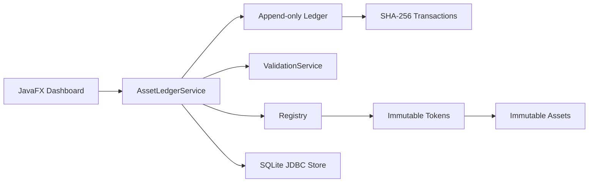

# AssetLedger

> A Java-based ERP module for tokenizing and tracking physical and financial assets with an immutable internal ledger.

AssetLedger is a portfolio-ready Java 17 application that demonstrates object-oriented domain modeling, hash-linked data structures, business-rule validation, and JDBC persistence in a fintech/ERP setting.

## Highlights

- Registers inventory, invoices, and equipment as uniquely identified tokens.
- Tracks current ownership separately from the immutable asset record.
- Appends every transfer to a SHA-256 hash chain.
- Rejects unknown tokens, unauthorized owners, same-owner transfers, and broken chain links.
- Stores tokens and transactions in SQLite through JDBC.
- Includes a JavaFX dashboard with search, type filtering, asset registration, ownership transfer, ledger history, and integrity status.
- Exposes the same registry and ledger through a Java Spring Boot REST API.
- Seeds four realistic sample assets and ten validated demo transfers on first launch.

## Run

```bash
cd asset-ledger
mvn test
mvn javafx:run
```

The desktop database is stored at `~/.assetledger/assetledger.db`.

## REST API

Start the Java API on port `8081`:

```bash
cd asset-ledger
mvn spring-boot:run
```

Set `PORT` to change the listening port, or set `ASSETLEDGER_DATABASE_PATH` to choose a different SQLite file.

| Method | Endpoint | Purpose |
| --- | --- | --- |
| `GET` | `/api/v1/health` | Service and ledger health |
| `GET` | `/api/v1/summary` | Portfolio counts, value, owners, and integrity |
| `GET` | `/api/v1/assets` | List assets; supports `search` and `type` filters |
| `GET` | `/api/v1/assets/{tokenId}` | Inspect one tokenized asset |
| `POST` | `/api/v1/assets` | Register a tokenized asset |
| `GET` | `/api/v1/ledger/transactions` | Read the append-only transaction history |
| `GET` | `/api/v1/ledger/verify` | Validate the full hash chain |
| `POST` | `/api/v1/assets/{tokenId}/transfers` | Validate and record ownership transfer |

Example:

```bash
curl http://localhost:8081/api/v1/summary
curl "http://localhost:8081/api/v1/assets?type=EQUIPMENT"
```

## Architecture



## Package map

```text
com.assetledger.domain       Asset, Token, Transaction, AssetType
com.assetledger.core         Registry, Ledger, ValidationService
com.assetledger.service      AssetLedgerService and demo seed data
com.assetledger.persistence  SQLite schema and metadata codec
com.assetledger.ui            JavaFX application and dashboard controller
com.assetledger.api           Spring Boot REST API and JSON DTOs
```

## Design choices

1. Assets and tokens are immutable; current ownership is held by the registry so the historical asset definition never changes.
2. Transactions include their own id, timestamp, previous hash, and derived hash, making tampering detectable without a networked blockchain.
3. SQLite stores the current registry projection and the append-only transaction history.
4. The demo seed is idempotent and only runs when the local database is empty.

## Scope

This v1 intentionally does not include live blockchain deployment, wallet integration, or multi-user networking.